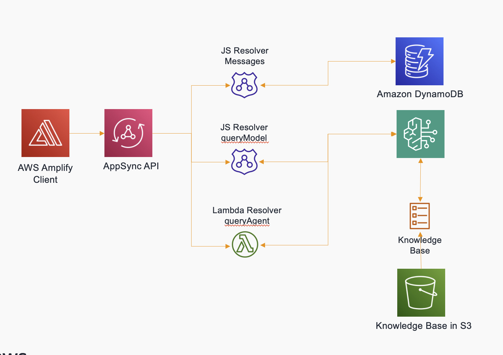

# Chatbot application using Amazon Bedrock Agents and Amplify Gen2
This project lets you provision a ready-to-use fully serverless chatbot application using Amazon Bedrock Agents and Amplify Gen2. The infrastructure code is using the [AWS Cloud Development Kit(AWS CDK)](https://aws.amazon.com/cdk/) and implemented in both Typescript. The frontend is written using [React + Vite + Amplify](https://github.com/sathishc/genai-sandbox/tree/main/chatbot-client).


## Solution Architecture



## Prerequisites

- [AWS CLI](https://aws.amazon.com/cli/) installed and configured with the aws account you want to use.
- [AWS CDK](https://docs.aws.amazon.com/cdk/latest/guide/getting_started.html) installed and configured with the aws account you want to use.
- [docker](https://docs.docker.com/get-docker/) installed and is up and running locally (required for the lambda function builds).
- [node-js 18](https://nodejs.org/en/download) installed. If using nvm, run `nvm use 18`

Before you start deployment, ensure that you have enabled Amazon Bedrock Models - Titan Embeddings V2 and Anthropic Claude Sonnet in the region where the stacks will be deployed. You can do this by logging into the AWS Console and using the [request model access](https://docs.aws.amazon.com/bedrock/latest/userguide/getting-started.html#getting-started-model-access) feature.

Also ensure that the region is correctly setup in the terminal environment where you are running the commands by executing
```
export AWS_REGION=<REGION> 
```

### Using AWS Cloud9
Above dependencies are pre-installed when using an AWS Cloud9 environment and hence can be skipped. When using cloud9 remember to resize your ebs volume though by running the following commands from root folder

```
chmod +x utils/cloud9-resize.sh
./utils/cloud9-resize.sh 100
```

## Security considerations
For the sake of this demo, **not all security features are enabled** to save cost and effort of setting up a working PoC. 

## Getting started


### Deploy the CDK stack

Switch to the infrastructure-ts folder, install the libraries and deploy the stacks

```
cd infrastructure-ts
npm install
cdk bootstrap
cdk deploy 
```
Please check the [readme](./infrastructure-ts/README.md) file in the infrastructure directory for more details.

### Building the frontend and middleware
- Change directory to where UI code lives.
```bash
    cd chatbot-client
```
- Restore NPM packages for the project
```bash
    npm install
```
- Deploy the Amplify middleware
```bash
    npx ampx sandbox
```
- Run the chat application
```bash
    npm run dev
```

Open the application in the browser and signup using your email. In the chatbot, type in your queries to see responses from the backend. To test the agent which you have deployed, start your queries with '/agent' for example you can query using
```
/agent show me my claims
```

### Cleanup
Run the following command in the relevant infrastructure directory to delete the cloudformation stacks:
```bash
    cdk destroy
```

## Found an issue? Anything to add?
See [CONTRIBUTING](CONTRIBUTING.md#security-issue-notifications) for more information.

## License

This library is licensed under the MIT-0 License. See the LICENSE file.
